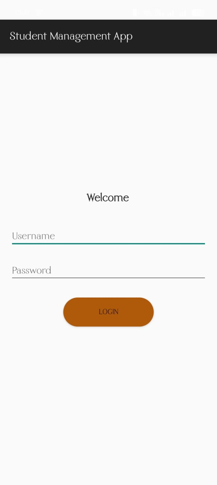
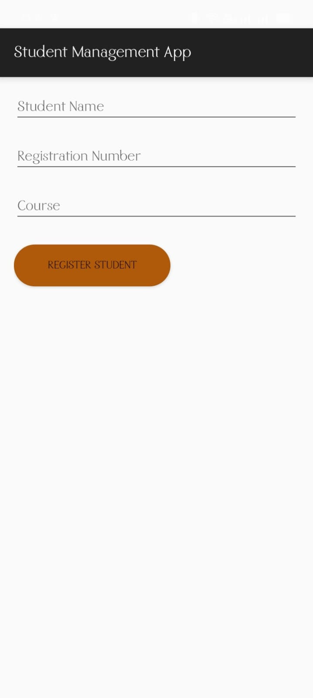
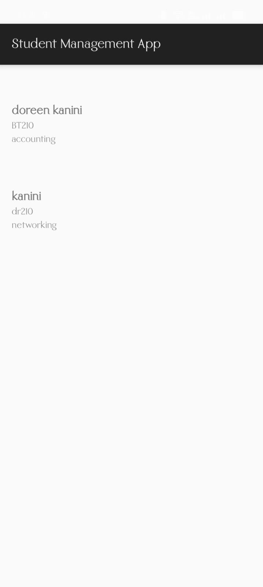
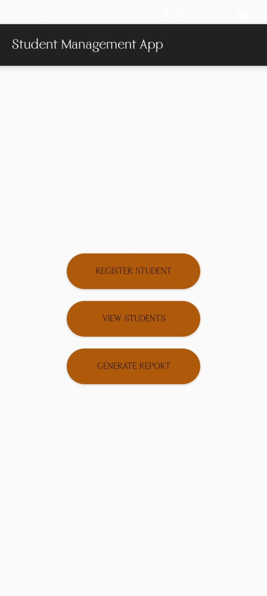

# 📚 SMIS Mobile App – Student Management Information System

## 🧭 Project Overview
The SMIS Mobile App is an Android-based student management system developed in Kotlin. It enables student registration, viewing, reporting, and performance tracking. It integrates a Room database for local storage and a Laravel backend for fetching student results.

---

## 🎯 Key Features
-   **Login Authentication** – Validates user credentials with toast feedback.
-  **Student Registration** – Form to register students with Name, Reg Number, and Course.
-  **View Students** – Displays all registered students using RecyclerView.
-  **Generate Report** – Fetches student performance from Laravel backend via Retrofit.
-  **Room Database** – Local storage with DAO for student data.
-  **Networking** – Retrofit + LiveData for API integration.

---

## 🖼️ Screenshots

| Login Screen | Register Student | View Students | Dashboard |
|--------------|------------------|----------------|-----------|
|  |  |  |  |

---

## 🧪 Backend Setup (Laravel)

The Laravel backend handles student performance data and exposes the `/students/results` API endpoint.

### 🔗 Repository
[smis-laravel-backend](https://github.com/yourusername/smis-laravel-backend)

